# 90's FOOTBALL SHIRTS
## Introduction
90's Football Shirts is a fictional site designed, developed and implemented with _Python_, _HTML_, _CSS_, and _JavaScript_. It is a vintage sports clothing store specializing in jerseys and tricots of football teams from the 90s.

The Deployed version of the site can be found [Here](https://nineties-football-shirts-8ef65f488fe9.herokuapp.com/)

## Showcase
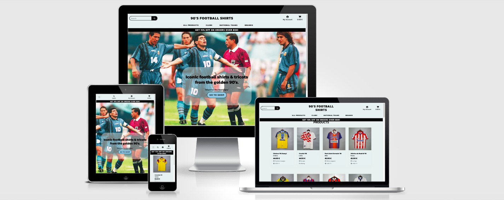

# UX

## Target Audience
The target audience of 90's Football Club extends beyond individuals interested solely in sports or football. We aim to appeal to those who have an interest in vintage fashion. Additionally, we seek to tap into consumers' nostalgia by revisiting prominent football figures and events from the 1990s

## User Stories

**EPIC: Registration and Profile**

* As a _Site User_ I can be able to _register_ a new account, so i have a _personal account and profile_
* As a _Site User_ I can easily *log in* and _log out_ so i can have _access to my personal account_
* As a _Site User_ I can _recover_ my password so i can _get access to my account again_
* As a _Site User_ I can be able to _receive an email_ after submitting my registration form so i can _verify_ my submision was succesfully done
* As a _Site User_ I can _edit_ my profile so i can _change_ payment and shipping information
* As a _Site User_ I can _have a personalized profile_ so that _i can have my orders, payment and shipping information_

**EPIC: Navitagtion**

* As a _Site User_ I can easily _navegate_ through the different sections of the site so i can have a good _user experience_
* As a _Site User_ I can have _a quick search by prices,_ so _I can easily find products within my budget_
* As a _Site User_ I can have a quick search by ratings so that _I can easily find highly-rated products._ 

**EPIC: Product**

***Site User*** 
* As a _Site User_ I can have a _view of products_ so i can _select_ some to purchase
* As a _Site User_ I can _add products_ to my shopping cart so i can _purchase them_
* As a _Site User_ I can _select size and quantity_ so i can have a _good experience_ when buying products

***Site Admin***
* As a _Site Admin_ I can _be able to add new products_ so that _i can create new content in the site_
* As a _Site Admin_ I can _update products in the site_ so that _i can edit any possible change_
* As a _Site Admin_ I can _delete products_ so that _I can update the stock of the shop_

**EPIC: Shopping Cart**

* As a _Site User_ I can _edit the items in my shopping cart_ so that _I don't have to come back to the product detail_
* As a _Site User_ I can _have a detailed view of prices_ so i can _be aware about shipping costs and discounts_
* As a _Site User_ i can have a detailed view of the products in my cart so _I know what I'm about to purchase_

**EPIC: Purchase**

***Site User***
* As a _Site User_ I can _add my shipping information_ so that _I make sure the items are shipped to the desired address_
* As a _Site User_ i can _add my payment details_ to purchase my products 
* As a _Site User_ I can _have a detailed list of items_ so that _I know exactly what I'm about to_ purchase

***Site Admin***
* As a _Site Admin_ I can _see a detailed list of orders_ so that _im aware about all the purchases from users_

**EPIC: Contact**

***Site User***
* As a _site user_ I can have _access_ to a _contact form_ so i can _message_ the owner in case of an inquiry
* As a _site user_ I can _contact_ the owner concerning an _specific_ product
* As a _site user_ I can get a _confirmation email_ so im _aware_ that the submission was _succesfully sent_

***Site Admin**
* As a _Site Admin_ I can _receive messages from users_ so that _I can be aware of any Inquire_

**EPIC: Wishlist**

* As a _Site User_ I can _have a wishlist_ so that _I can have a list of items that i like_
* As a _Site User_ I can _add and remove items from my wishlist_ so that _i have a personalized list_

**EPIC: Ratings**

* As a _Site User_ i can _see a ratings field_ so _I know which are the favourite items from other users_
* As a _Site User_ I can rate a product so that _I can leave my feedback for other users_
* As a _Site User_ I can _update my ratings_ so that _I can reflect any changes in my experience_

### A list of detailed _Acceptance Criteria_ and _Tasks_ for each User Story can be found here:
* [Project: 90's Football Shirts](https://github.com/users/Kiko-Climent/projects/8)
* An _Agile metodologie_ was implemented in order to develope the whole project.

### Strategy

_90's Football Club_ is a website that seeks to unite the passion for sports, specifically football, and vintage fashion, creating a time capsule to revisit great moments from football events during the golden era of the 90s.

## Architecture

## Database

Click to review the database schema: 

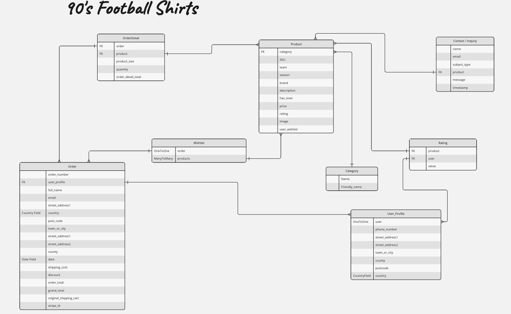

## Navigation

Click to review the navigation flow: 

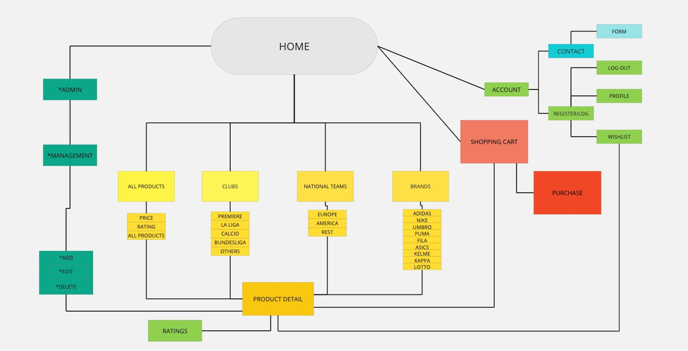

## Design

Click to review the the wireframes: 

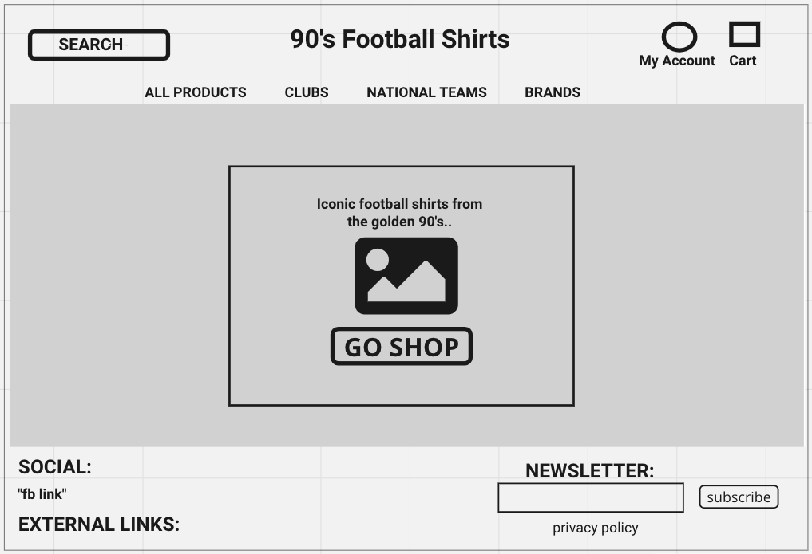
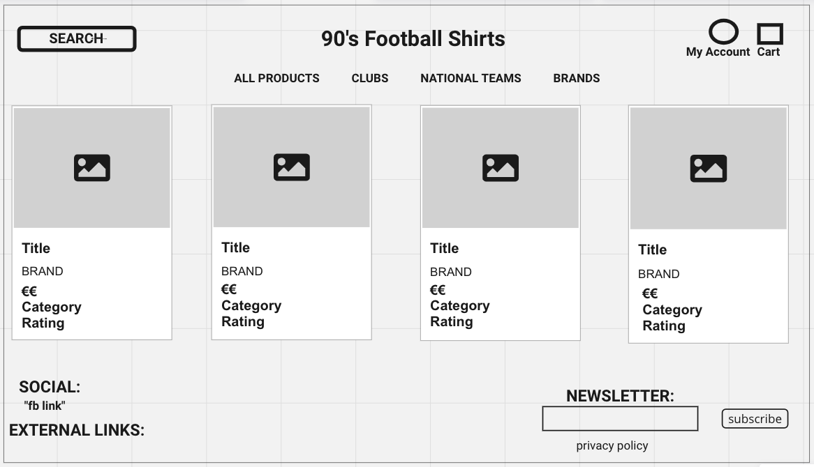
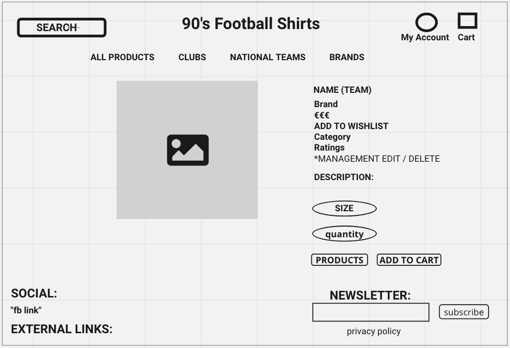
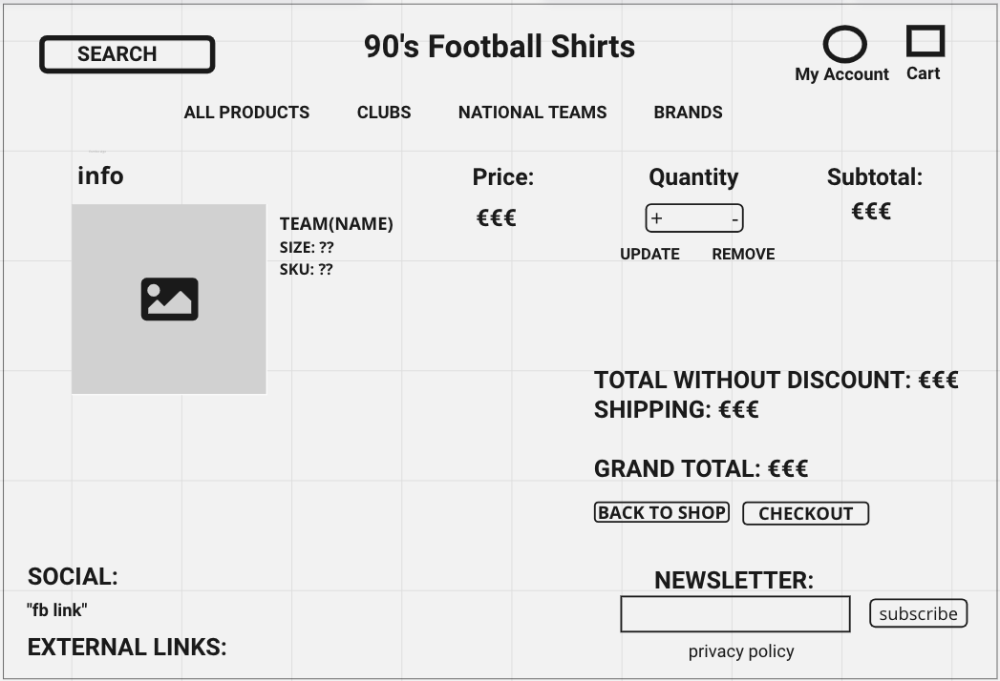
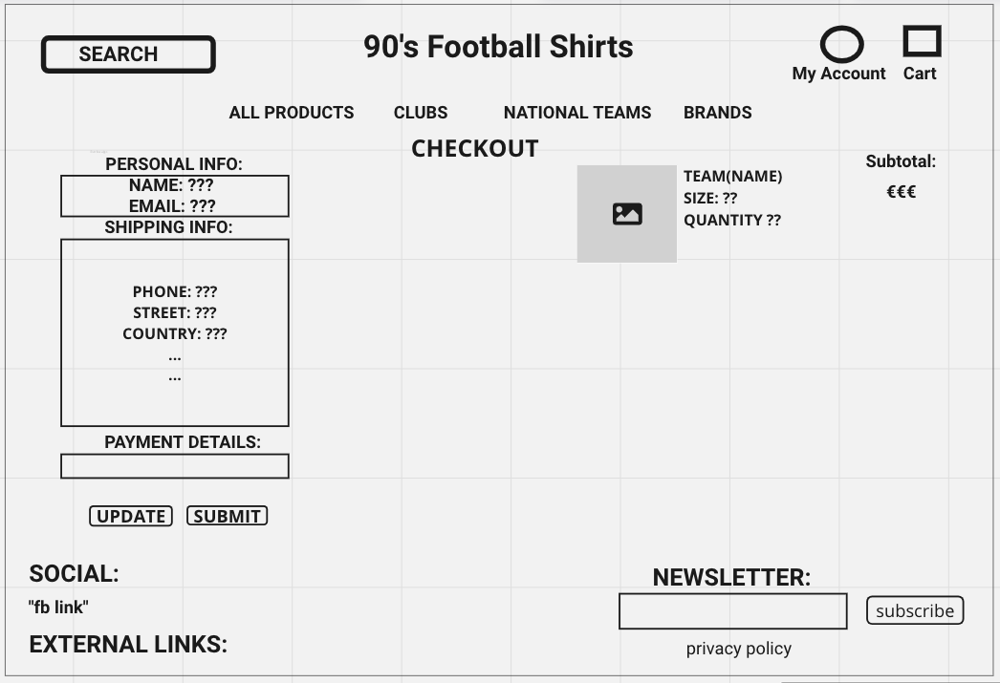
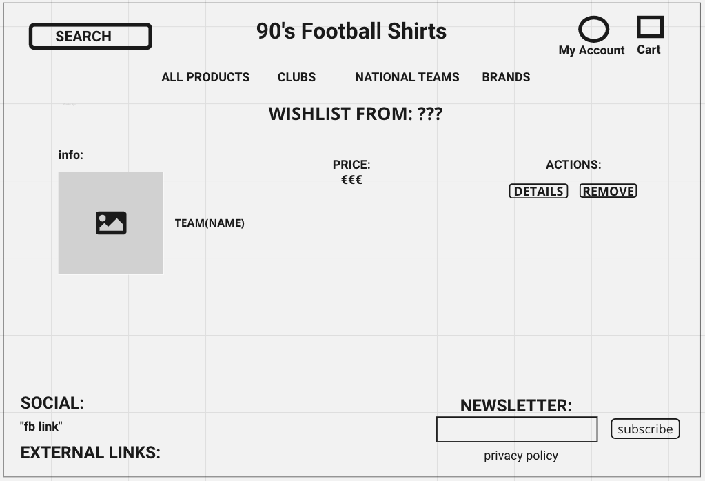

## E-Comerce Type

90's Football Shirts operates as a B2C business, functioning as a digital online store where users can purchase retro sports kits. The primary objective for the administrator is to successfully implement CRUD functionality.

## Marketng

90's football shirts has decided to use social media marketing as the main technique in the development and spread of the content on the page. The social network _Facebook_ was chosen to implement this technique. You can visit the profile [Here](https://www.facebook.com/profile.php?id=61556575044215)

Email marketing was also used to create engagement with new users of the page; in this case, we opted for _Mailchimp_ as the tool.

### Color Scheme

The colors used for the site design adopt a sober and simple style. I aimed to steer away from the typical white background to impart a retro and lo-fi touch, which I believe aligns with the _vintage_ concept of the page. Additionally, the muted blue tone complements perfectly with the landing page image.

### Typography

The font used for the development of the site was _Kanit_
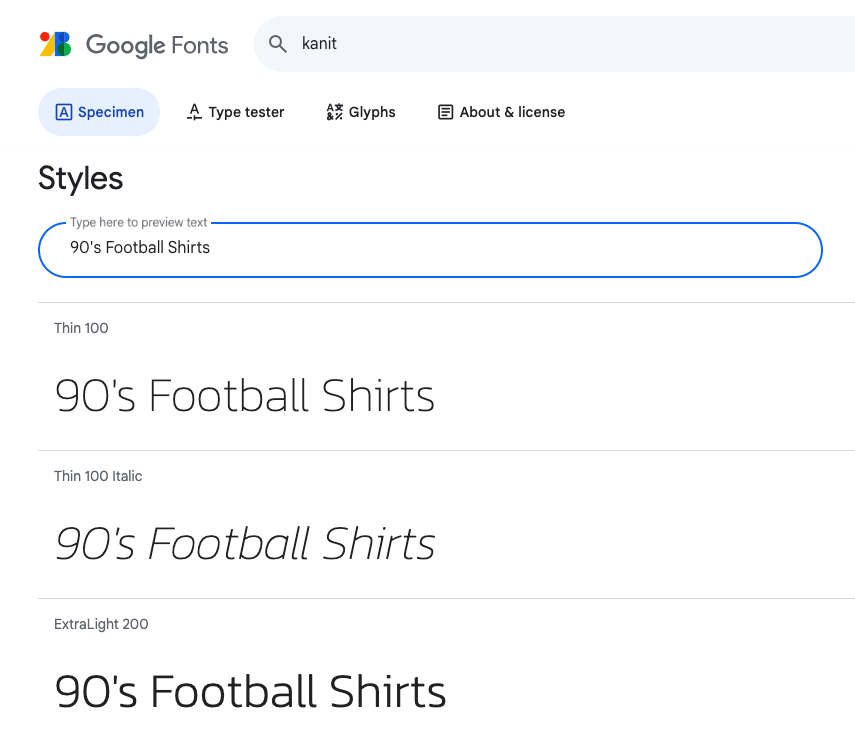

...
# Features
## Homepage:
The landing page, where the user initially arrives, serves as the starting point of the website. On this page, users encounter various features to interact with.
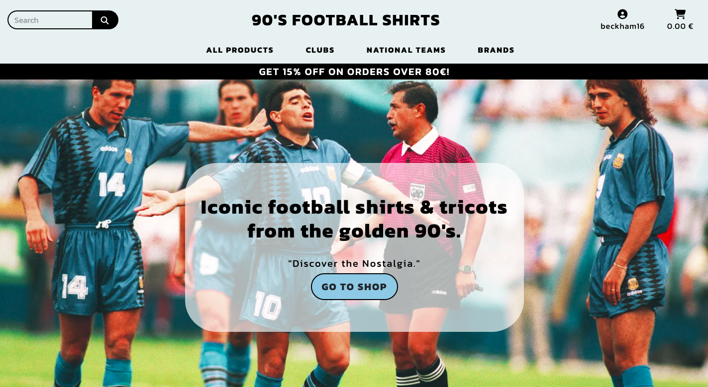

### Header and Navigation:
Logo site centered, with the search bar displaying on the left while the link to the shopping cart and the user's acount menu displaying on the right.
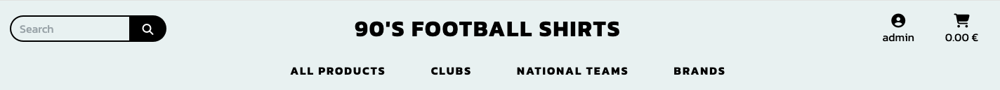

### Home Image and Call-to-Action:

### Discount and Shipping info tab:

### Footer:
In the footer, visitors can access our Facebook page through a provided link, explore external links containing relevant information, and have the option to subscribe to our newsletter.
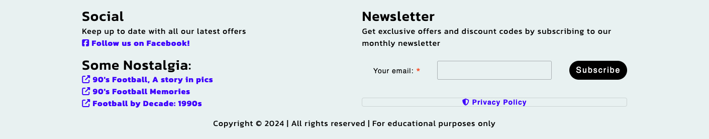

### My Account (User):
For users who are already registered and have an account, the user menu will display their benefits, such as having a user _Profile_ and their own _Wishlist_. The _Contact Form_ will be a benefit enjoyed by those users who are not registered as well.

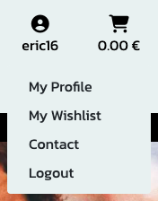

### My Account (Admin):
Unlike the user menu for those who are registered, the admin menu provides a direct link to the _Management_ section where the admin can add new products to the store through a new interface.

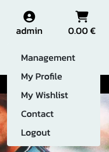

### Categories:

Users have the ability to navigate through the different categories of the page.

- In the *All Products* section, users can access all the products in the store, and they will be able to sort them by _Price_ or _Rating._

- *Clubs:* Here, products in the store are organized by leagues, including the _Premier League, La Liga, Serie A, Bundesliga,_ and a general category including products from _Other leagues._

- _*National Teams:*_ In this section, products belonging to national teams will be selected, with subcategories organized by continent.

- _Brands:_ Finally, users will also be able to view products sorted by sports _brands_ such as _Adidas, Nike, Umbro, Puma,_ etc.

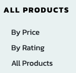
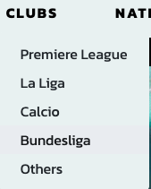
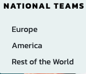
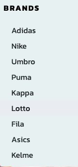

- Sorted by Price:
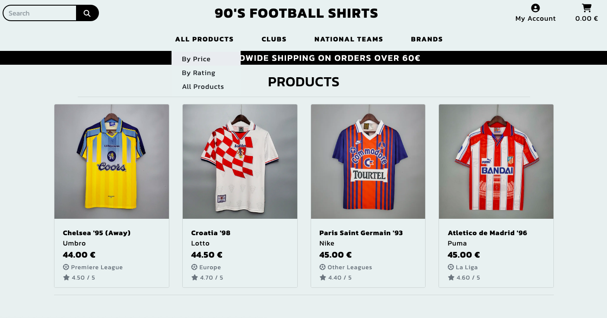

- Sorted by Ratings:
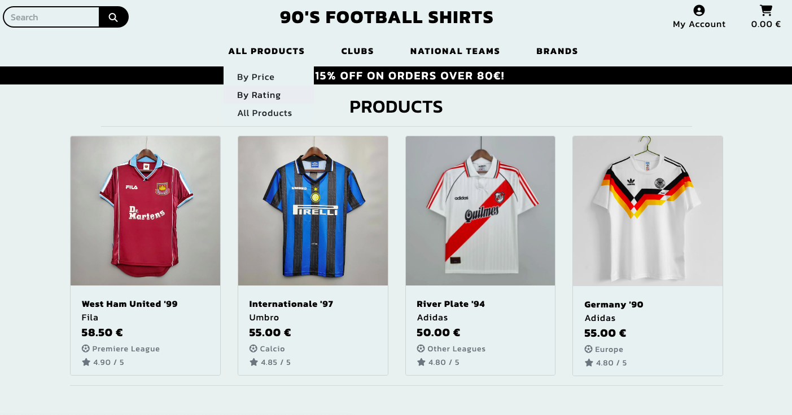

## Registrartion:
### Sign Up:
As mentioned earlier, and although it's possible to place orders for non-registered users, users should register to access their profiles and have control over the wishlist.

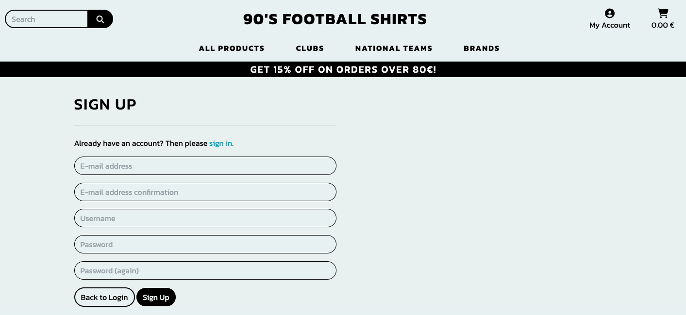

### Log In page:
For already registered users, the form to access the user profile is straightforward. Username and password are the only required fields.

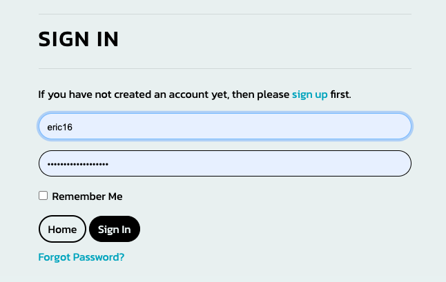

### Log In Success:
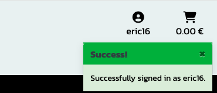

### Log Out:
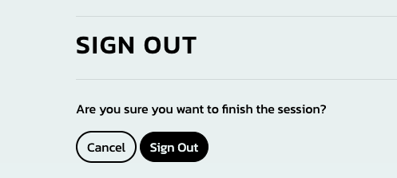

## Products:
### All Products Page:
The view of all products includes a brief description of the item, which comprises the _Team Name, _Price, Sports Brand, Category or League_ in which the product is located, and the product's _Rating._

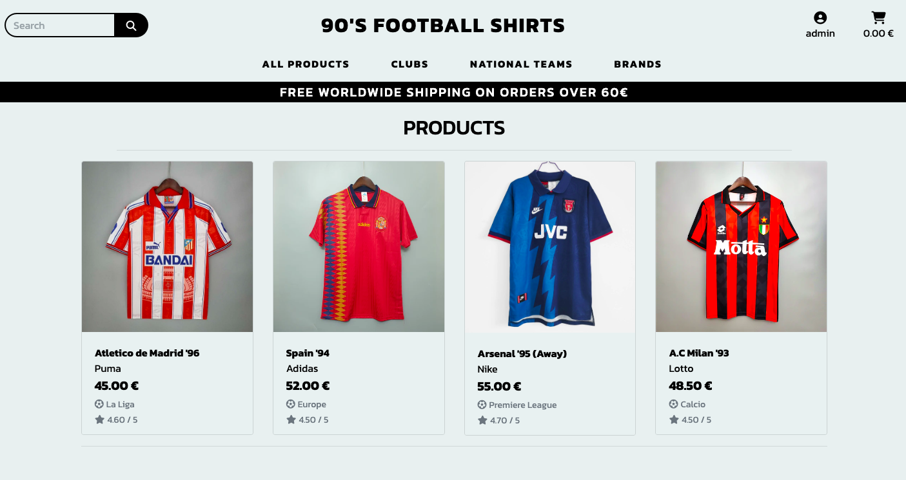

### Product Detail Page:
Selecting a desired item, we enter the product details, where a slightly longer description takes center stage. In addition to the fields mentioned earlier, the product includes a brief text describing the team, its achievements, and some interesting memorabilia.

_Size_ and _Quantity_ selection buttons are included, with a maximum of 5 units per item, as the allowed maximum.

At the bottom, users will find buttons to _Add the item_ to the _Shopping Cart_ and another one to navigate back to the complete list of products.

For registered users, the possibility to submit their own rating and add the product to their wishlist will also be available.

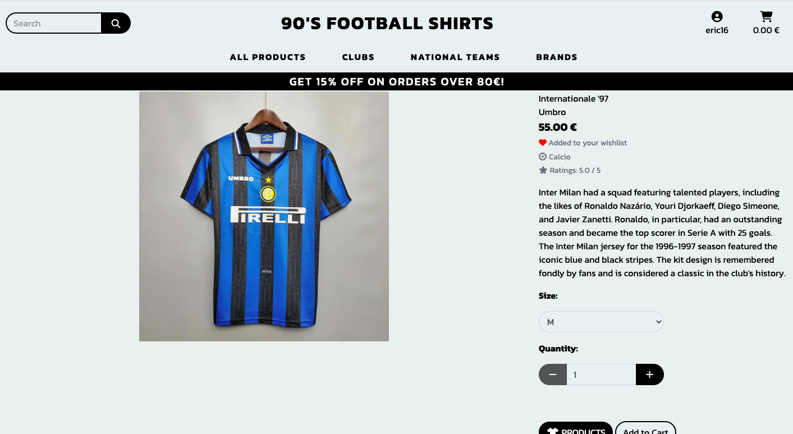

### Product Detail Info:
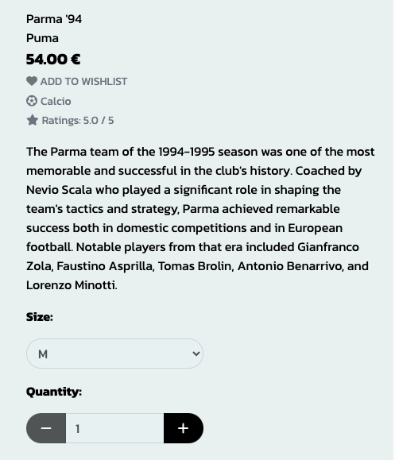

## Rating:
Upon clicking the _Ratings_ icon, the user will be shown a dropdown menu where they can enter their own rating

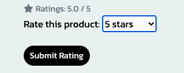

## User's Wishlist:
Regarding the _Wishlist,_ Users can add items to the wishlist by clicking the Heart icon in the product description. The _Wishlist_ will display the products selected by the registered user in the product detail view. It's quite simple, including only the _Image, Team, Price,_ and two buttons—one to access the _Product Details_ again and another to _Remove_ it from the wishlist.

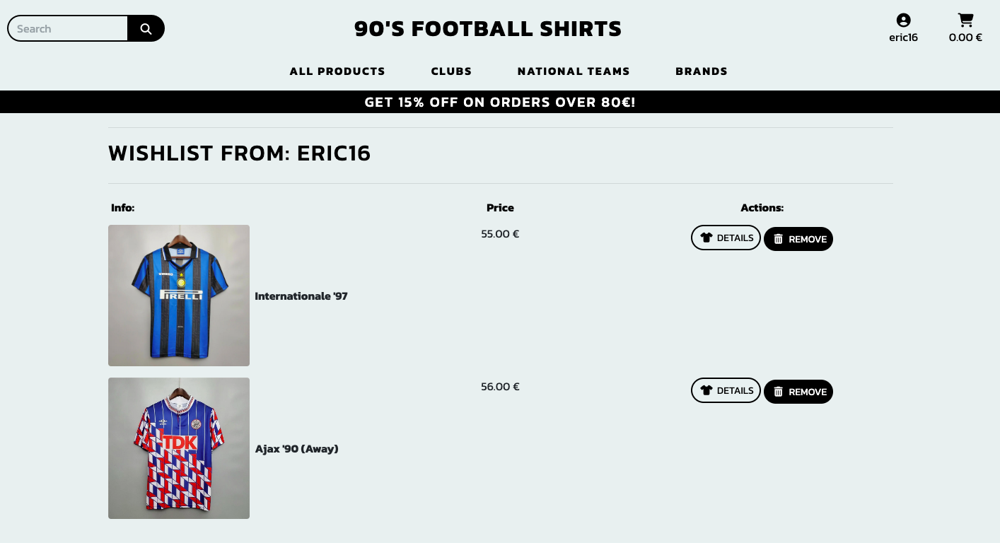

## Shopping Cart:
The shopping cart will show all users the products they have previously added. Here, in addition to the image, the team's name, and the price, the selected size and quantity will be displayed, with the option to update or remove the quantity. In the same row, a column for the product subtotal will also be available.

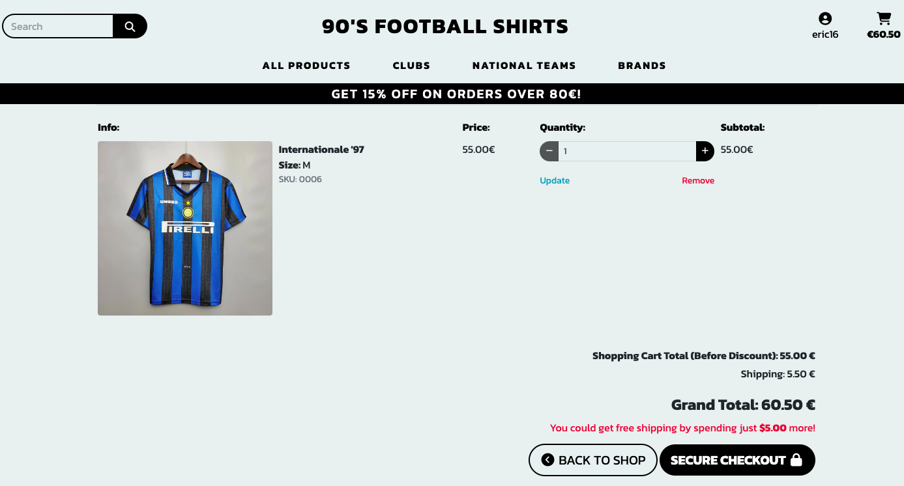

At the bottom, a cost _breakdown_ will be provided to the user. This includes the total price _before discount_, the amount to be _discounted (if applicable),_ as well as the _shipping costs (if applicable),_ and the _Grand Total,_ which is the amount the user needs to pay.

Finally, the user will find a button to return to the store and another one to proceed to the checkout page.

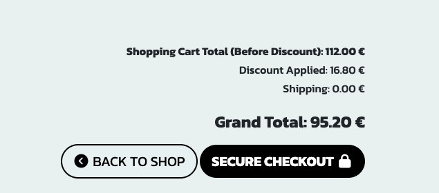

## Purchase:
On the Purchase page, we find a _summary_ of the user's cart at the top right. Meanwhile, on the left side, there is a form where the user will enter the _shipping details_ for the products about to be purchased. Just below, there is a field to enter _credit card information,_ as well as two buttons—one to _proceed_ with the payment and another to go _back to the cart_ in case any modifications are desired.

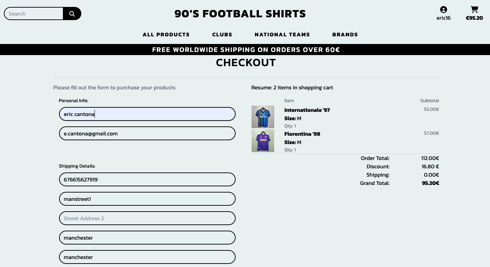
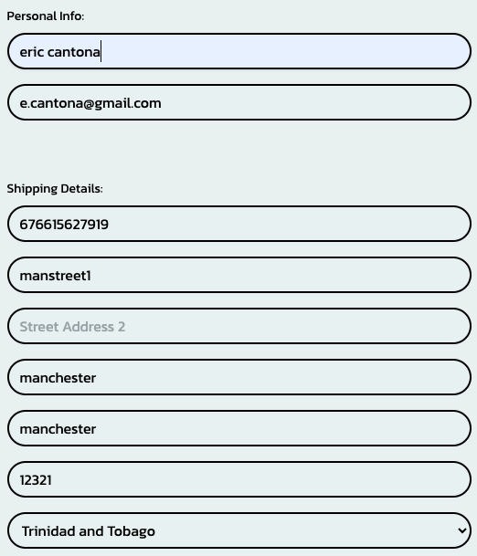
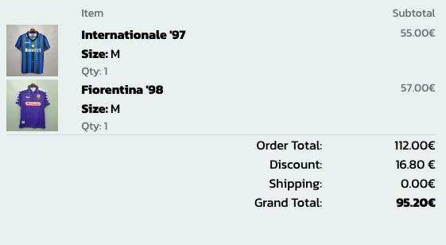
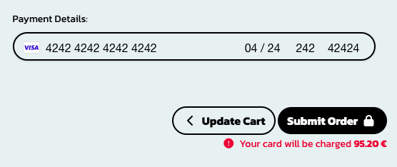

### Purchase-Success:
After the payment has been processed, the user will be redirected to the _Purchase Success_ page. In addition to a _confirmation message_ at the top, the _details_ related to the purchase will be displayed. A _Confirmation email_ will also be sent to the email address provided by the user earlier.

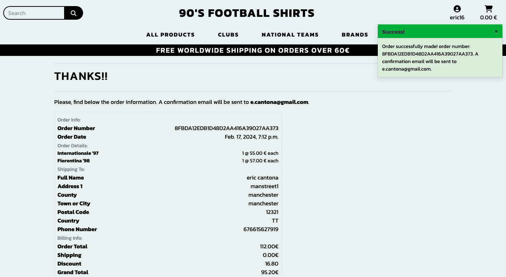
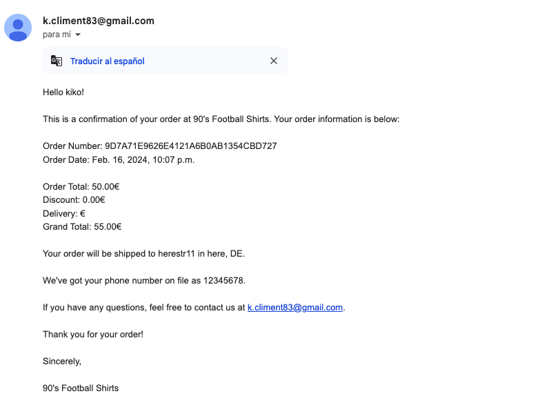

## Profile:
### User's Profile:
The user profile consists of 2 sections, the first one with the _shipping details_ of the users that can be modified if the user wishes, and another section where the _Previous Orders_ will be stored.

Clicking on any of the past orders redirects us to the "Purchase Success" page for that specific order, with a message informing the user

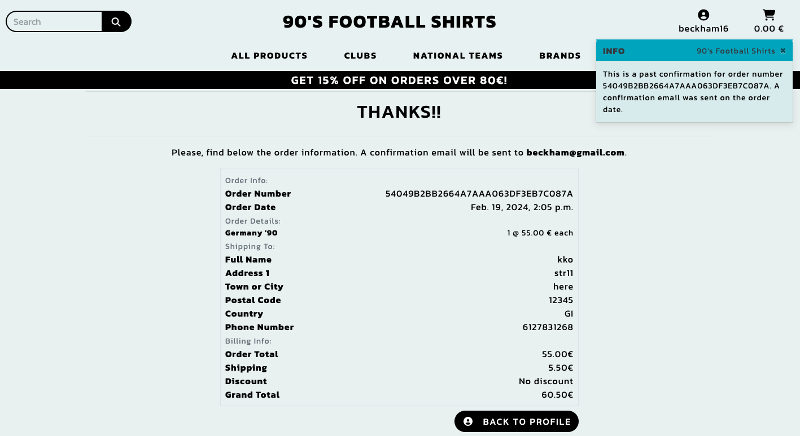

## Contact
### Contact Form:
The _Contact form,_ available in the dropdown menu of the _accounts icon,_ is accessible to _all users,_ whether registered or not. In it, the fields to provide a response are mandatory. As for the _Subject,_ the user can choose between _General Inquiry_ or _Product._ Another dropdown menu that includes a list of all the products in the store will also be provided to ensure a good experience for both the admin and the user. In the _Message_ field, the user can explain the inquiry to the administrator.

### Contact Success
Once the fields have been filled out successfully, a confirmation message as well as an email will be provided to the user.

## Management:
The page administrator will have the ability to create new content for the page, as well as edit or delete existing content.

In the _Accounts_ icon, only the authenticated administrator will see a link labeled _Management,_ which will redirect them to the page for uploading new products to the store.

### Add New Product:
The form for _adding new products_ to the store includes all the fields that will later be displayed in the product _description_ within the _Product Detail_ page.

### Edit / Delete Product:
Within the Product Detail page, if the authenticated user is the administrator, a new field will be displayed in the description where they can update or delete the product. Both links are also avilable from the _All Products_ page.

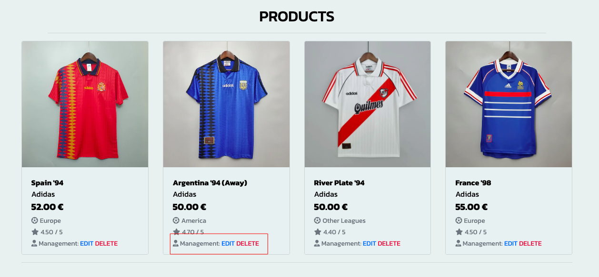

### 404 Error:

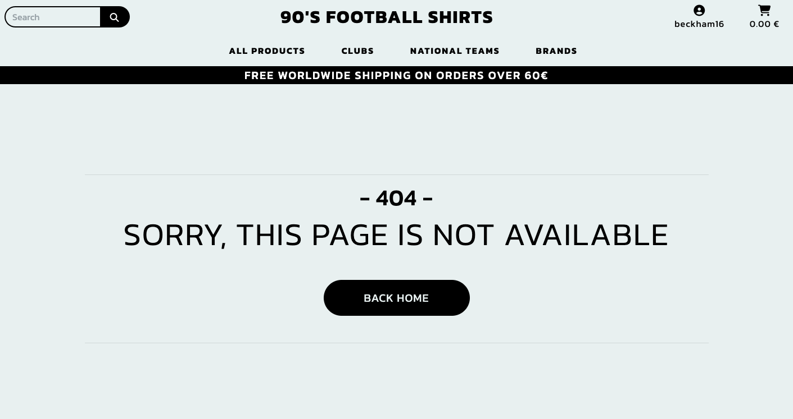

### Future Implementations
The project was initially created with the possibility that items without sizes would also be accommodated. Products like retro-style scarves or caps are some things that could be implemented on the site in the future.

A _Blog_ section was also highly present in the project's development. A place where retro football enthusiasts could discuss great moments in football history, iconic players, unforgettable goals, and legendary matches. Undoubtedly, it would be a great addition to the site.

It could also be implemented a functionality where the user, in addition to being able to leave the rating, could provide _feedback_ after experiencing a purchase, for example. This would enhance the user experience.

# Web Marketing

## Email Marketing:
_Mailchimp_ was used in order to implement a Web marketing strategy. Users can find the registration form located inside the footer and just by entering the email adress they will be automatically subscribed to the Monthly newsletter.

## Search Engine Optimization:
SEO words selected as keywords:

Apparently, Wordtracker has changed its configuration, and unfortunately, I was only able to perform one search, and another one in incognito mode.

## Social Media:
_Facebook_ was used as plattform to develope the _Social media marketing_. Due to the simplicity and scope i thought it would be the best tool to implement it the social media strategy.

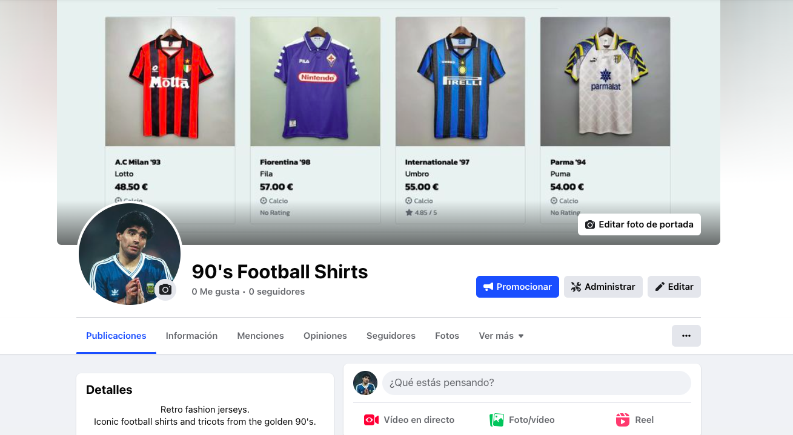
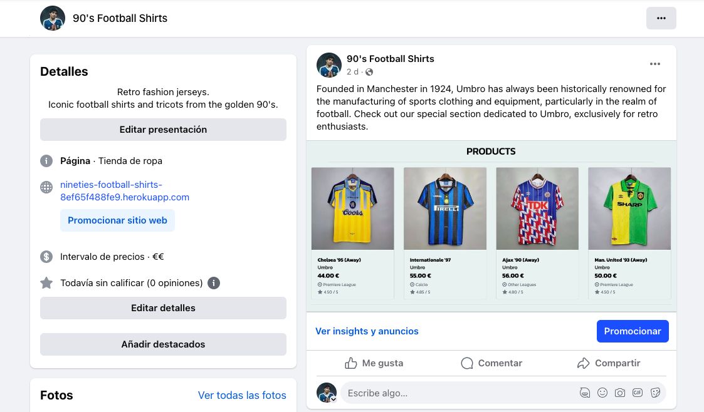
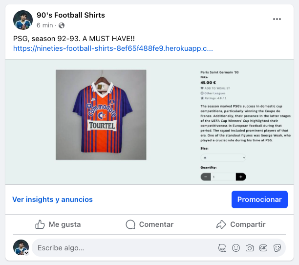

# Technologies:
## Languajes:

- [HTML](https://developer.mozilla.org/en-US/docs/Web/HTML)
- [CSS](https://developer.mozilla.org/en-US/docs/Web/CSS)
- [JavaScript](https://www.javascript.com/)
- [Python](https://www.python.org/)

## Libraries and Frameworks:

- [Gitpod](https://www.gitpod.io/) The entire project was deloped with Gitpod.
- [Heroku](https://www.heroku.com/) Used to Deploy and to host the project.
- [Github](https://github.com/) Used for the version control and to develope the Agile metodology.
- [Cloudinary](https://cloudinary.com/) For the storage of all media and static files.
- [ElephantSQL](https://www.elephantsql.com/) Used as database.
- [Stripe](https://stripe.com/en-ie) Used to manage the online payments.
- [Miro](https://miro.com/app/dashboard/) To create dabatabase schema and flow schema.
- [Bootstrap](https://getbootstrap.com/) To aply styles to the project.
- [Django](https://www.djangoproject.com/) Python framework used to create and develope the whole project.
- [Django-Allauth](https://docs.allauth.org/en/latest/) Used for the authentication, registrartion and account management.
- [Django-Crispy Forms](https://django-crispy-forms.readthedocs.io/en/latest/) To control the rendering behavior of the forms.
- [Django-Countries](https://pypi.org/project/django-countries/) To provie a country field for models.
- [Font Awesome](https://fontawesome.com/) Used to add icon to the site.
- [Gunicorn](https://gunicorn.org/) WSGI server for running Python web applications.
- [Pillow](https://pypi.org/project/pillow/) Python Imaging Library fork that provides easy-to-use methods for opening, manipulating, and saving various image file formats.

# Testing
## Manual Testing

### Home / Landing Page
| Feature | Test | Expected Result | Result |
| -------------| ----- | ----- | :----: |
| 90'S FOOTBALL SHIRTS | Click on Logo in Homepage | redirects user to home page | Pass |
| Navbar links | Click on Navigation Links | Redirects user to selected page | Pass |
| All Products | Click on All Products | Dropdown menu with the three categories | Pass |
| By Price | Click on By Price | Sort the products by price (lower to higher) | Pass |
| By Ratings | Click on By Price | Sort the products by rating (higher to lower) | Pass |
| All Products (Subcategory) | Click on All Products | Shows all the products in store | Pass |
| Clubs | Click on Clubs | Dropdown menu with the different leagues | Pass |
| Select league | Click on each league | Sort the products corresponding to the selected league | Pass |
| National Teams | Click on National Teams | Dropdown menu with the different continents | Pass |
| Select Continent | Click on each continent | Sort the products corresponding to the selected continent | Pass |
| Brands | Click on Brands | Dropdown menu with the different brands | Pass |
| Select Brand | Click on each brand | Sort the products by brands | Pass |
| Go to Shop | Click on Go to Shop Button | Shows all the products in store | Pass |
| Facebook icon | click on facebook icon | redirects user to facebook page |  Pass |
| Some Nostalgia (External Links) | click on the links | redirects the user to the selected external link | Pass |
| Sign up for our newsletter | click on Sign up for our newsletter | redirects user Sign up for our newsletter page |  Pass |
| Mailchimp logo | Click on Mailchimp logo | redirects user to Mailchimp homepage | Pass |
| Privacy policy | click on privacy policy | redirects user to privacy policy|  Pass |
| Search | Using the search box | Entering a search returns expected result  |  Pass |
| Search no results | Blank field | Entering a no results search returns error message and shows all products  |  Pass |
| My Account | Click on My Account | Dropdownn menu with 3 categories for the unlogged users | Pass |
| Register | Click on Register | Redirects user to sign up form | Pass |
| Log in | Click on Log in | Redirects user to log in page | Pass |
| Contact | Clic on Contact | Redirects user to contact form | Pass |
| Shopping Cart | Clic on Shopping Cart icon | Redirects user to Shopping Cart | Pass |

### Footer
| Feature | Test  | Expected Result | Result |
| -------------| ----- | ----- | :----: |
| External Links | Click on any external links | Open links in a new tab | Pass |
| Facebook Link | Click on facebok icon | Open Facebook page in a new tab | Pass |
| Newsletter | Insert email address to sign up | Register success | Pass |
| Newsletter | Insert blank field | This field is required | Pass |
| Newsletter | Insert existing email | Already subscribed | Pass |

### USER:

### Register
| Feature | Test | Expected Result | Result |
| -------------| ----- | ----- | :----: |
| Sign up form | Fill all the fields correctly | Verification email sent to user / Info Toast | Pass |
| Confirm e-mail adress | Click on Confirm | Account created / Success Toast | Pass |
| Sign up form | Leave some fields | Alerts user about it | Pass |
| Sign up form | Different email confirmation field | Alerts user about it | Pass |
| Sign up form | Different password confirmation | Alerts user about it | Pass |

### Log in
| Feature | Test | Expected Result | Result |
| -------------| ----- | ----- | :----: |
| Log in page | Introduced correctly both usernae and password | Succesfully logged in / Success Toast | Pass |
| Log in page | Invalid usernae or password | Alerts user abou it | Pass |

### Contact
| Feature | Test | Expected Result | Result |
| -------------| ----- | ----- | :----: |
| Contact Form | Fill all the fields correctly | Email confirmation sent / Success Toast | Pass |
| Contact Form | Leave some fields | Alerts user about it | Pass |
| Subject Type | Dropdown Menu | Select General or Product Inquiry | Pass |
| Product | Dropdown Menu | Select a product from the shop | Pass |

### My Profile
| Feature | Test | Expected Result | Result |
| -------------| ----- | ----- | :----: |
| My Profile | Once logged in click on My profile | Redirects to user's profile | Pass |
| User's Profile | Once logged in click on My profile | Shows Shipping Details and Past Orders | Pass |
| Update Profile | Click on Update Profile after editing details | Updates Shipping info | Pass |
| Past Orders | Click on Order Number | Redirects to Purchase Success from selected order / Info Toast | Pass |

### My Wishlist
| Feature | Test | Expected Result | Result |
| -------------| ----- | ----- | :----: |
| My Wishlist |  Once logged in click on My Wishlist | Redirects to user's wishlist | Pass |
| User's Profile | Once logged in click on My Wishliste | Shows a list of wished items from user | Pass |
| Remove from Wishlist | Click on Remove | Product removed from wishlist / Success Toast | Pass |
| Product Details | Clic on Details | Redirect to product details | Pass |

### Log out
| Feature | Test | Expected Result | Result |
| -------------| ----- | ----- | :----: |
| Log out | Click on Log out | Redirects user to Sign Out page | Pass |
| Sign out page | Click on Cancel | Redirects user to Home page | Pass |
| Sign out page | Click on Sign out | Redirects user to Home page / Success Toast | Pass |

### Products
| Feature | Test | Expected Result | Result |
| -------------| ----- | ----- | :----: |
| Product Detail | Click on a product | Redirect to product's details | Pass |
| Add to Wishlist | Click on Add To Wishlist icon | Icon lights / Item moves to users wishlist | Pass |
| Category | Click on Category (League) | Redirects to Category | Pass |
| Ratings | Click on Ratings | Dropdown menu to rate the product | Pass |
| Rate | Select a rating and Submit | Add rating to ratings / Sucess Toast | Pass |
| Update Rating | Select a new rating and Submit | Rating changed / Success Toast _Rating Updated_ | Pass |
| Size | Click on size's dropdown menu | Select a size | Pass |
| Quantity | Click on (+ or -) buttons | Select a quantity (max of 5 units per product) | Pass |
| Add to Cart | Clic on Add to Cart button | Item moves to Cart / Success Toast / Pass |
| Products | Click on Products button | Redirect to All Products page | Pass |

### Shopping Cart
| Feature | Test | Expected Result | Result |
| -------------| ----- | ----- | :----: |
| Shopping Cart List | List of products added | Show product selected sizes, quantities, prices and subtotal |
| Edit Quantity | Click on (+ or -) buttons and Update | Recalculate all amounts in Cart / Success Toast | Pass |
| Delete Product | Click on Remove | Remove product from Cart / Success Toast | Pass |
| Shopping Cart Total | Shows amount without discount | Shows amount without discount | Pass |
| Discount Applied | Shows amount discounted (if applyed) | Shows amount discounted (if applyed) | Pass |
| Discount Applied | Shows no field (if no applyed) | Shows no field (if no applyed) | Pass |
| Shipping | Shows Shipping costs (if applyed) | Shows Shipping costs (if applyed) | Pass |
| Grand Total | Shows the final amount to pay by user | Shows the final amount to pay by user | Pass |
| *Recalculate Amount Fields | Update quantity or remove items | Shows recalculated amounts | Pass |
| Back to Shop | Click Back to Shop button | Redirects to All Products | Pass |
| Secure Check out | Click on Secure Check out | Redirects to Purchase Page | Pass |

### Purchase
| Feature | Test  | Expected Result | Result |
| -------------| ----- | ----- | :----: |
| Checkout View | Shows Purchase form and Resume of products | Shows Purchase form and Resume of products | Pass |
| Products' Resume | Shows Item, size, quantity | Shows Item, size, quantity | Pass |
| Amount Resume | Shows Subtotal, Total, Discount, Shipping Costs and Grand Total | Shows Subtotal, Total, Discount, Shipping Costs and Grand Total | Pass |
| Purchase Form | Fill form with correct data and Submit | Redirects to Purchase Success / Email confirmation sent / Success Toast / | Pass |
| Purchase Form | Fill form with blank fields | Alerts user about it | Pass |
| Purchase Form | Fill form with blank card details | Atempts to process, fail and alerts user about it | Pass |
| Purchase Form | Fill form with invalid card details | Atempts to process, fail and alerts user about it | Pass |
| Update Cart | Click Update Cart button | Redirects to Shopping Cart | Pass |

### ADMIN:

### Add Product:
| Feature | Test  | Expected Result | Result |
| -------------| ----- | ----- | :----: |
| Add New Product | Click on Management in User's Account Icon | Redirect to Add New Product Page | Pass |
| Product Management | Add New Product form | Shows the form for adding new product | Pass |
| Add New Product form | Fill the form with correct data | Creates new product in the shop / Success Toast | Pass |
| Add New Product form | Fill the form with blank data | Alerts the admin about it | Pass |
| Add New Product form | Fill the form with no picture | Creates new product in the shop without picture / Success Toast | Pass |

### Edit Product:
| Feature | Test  | Expected Result | Result |
| -------------| ----- | ----- | :----: |
| Edit Product | Click on Edit in the Product Detail | Updates product / Redirect to Edit Product Page / Info Toast | Pass |
| Edit Product | Edit product fields and click on Update Product | Redirect to Product Detail Page / Success Toast | Pass |
| Edit Product | Leave blank fields and click on Update Product | Alerts the admin about it | Pass |

### Delete Product:
| Feature | Test  | Expected Result | Result |
| -------------| ----- | ----- | :----: |
| Delete Product | Click on Delete in the Product Detail | Delete product / Redirect to All Products / Success Toast | Pass |

## Functionality testings:
For the development of the project, Chrome and Chrome DevTools were used to assist with debugging. Responsive testing was carried out using Chrome's functionality to emulate different types of devices.

## Compatibility Testings:
In addition to Chrome emulated devices, a MacBook Air, a Samsung A22, and an iPhone 12 were also used to test the project.

## HTML testings:

After testing with [W3](https://validator.w3.org/) found the following errors:
* no closing tag for _strong_: just added </> 
* _w-100_ inside of an _id attribute_ changed to a _class= w-100_ and deleted the id=w-100
* _aria-labelledby attribute_ with different name as the _id_, changed the name of the aria-labelledby to match with the id name
* found 2 elements with same _id_, just changed one of them in order to by both unique.
* Also found a warning: _The type attribute is unnecessary for JavaScript resources_

## CSS Testings:

The CSS files were tested using [Jigsaw](https://jigsaw.w3.org/css-validator/) were no errors were found.
[90's Football Shirts Jigsaw](media/readme_media/jigsaw_validator.png)

## Javascript Testings:

No major errors were found after testing the scripts in [JShint](https://jshint.com/)

## Python Testings:

Python was tested using [Pep8](https://pep8ci.herokuapp.com/), found some warnings most of them were concerning blank lines containing white spaces, trailing whitespace, lines being too long or expected 2 blank lines and found 1. All warning were fixed.

## Lighhouse:
To assess accessibility on the website, the deployed version utilized the _Lighthouse_ tool.
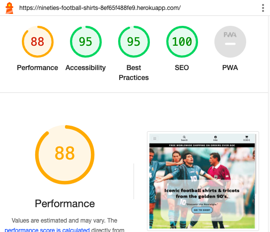

## Bugs

### Solved Bugs:

***ADMIN PANEL***
I had an issue that took up a significant part of my last afternoon before submitting the project. In my live version, when redirecting to the admin panel, the page seemed not to pick up the static files, having this appearance:

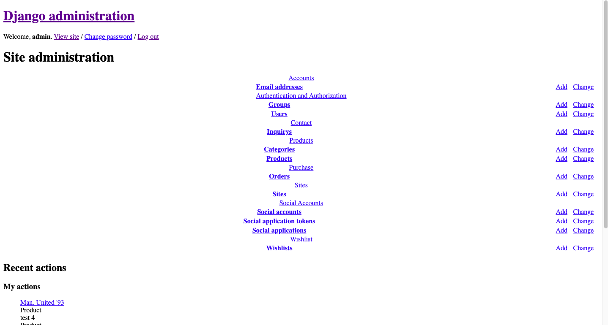

It was very weird cause all the ther static and media files were displaying well. After many research attempts, I reorganized the installed apps of my project within the settings file. I deleted all the static files belonging to the admin folder inside Cloudinary. None of this seemed to work, but after searching for solutions with two different tutors, we saw that deleting DISABLE_COLLECTSTATIC on Heroku made everything work well."

***CIRCULAR IMPORT***
While creating the functionality for ratings on the page, I had to make modifications to the Product model by creating a function to calculate an average of user ratings. When performing migrations, they were giving an error until I discovered that a **circular import** was occurring with the rating models since I was trying to import the _Rating_ model at the topl level of the file. To solve this, I performed a **local import** in the 'avg_rating' function in the Products model

***SIZES NOT GETTING RENDERED***
I also found a bug when adding products to the shopping cart. When a product was selected a with a specific size, the size was not getting rendered in the shopping cart. As I mentioned earlier, the page was initially created with the possibility of adding eventually products that did not have sizes, which is why in the Product model, I set initially the field _has sizes = False._ So all the products added from the fixtures filed didnt get the sizes rendered. Once the admin front was created in order to add and edit new products i could, with the admin credentials, edit the default field _sizes_ to yes.

***404 ERROR WHEN ADDING ITEMS TO WIHSLIST WITH NEW REGISTERED USERS***
During the development process and in the live version, I found that new registered users, when trying to access their wishlist without having added any products to the list, encountered a 404 error. The problem was resolved once products were added to the wishlist, even if the list remained empty, the error message did not appear. However, the issue persisted for new registrations.

To address this bug, I created a **try/except** block to handle the _Wishlist does Not Exist_ in my code, and thus, I was able to eliminate it.

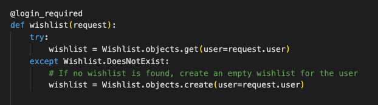

***SMTP***
When implementing the functionality to send email notifications to users via Gmail, I found that _SMTP_ was not compatible with the current version of Django I was using. Initially, I tried to update the Django version, but this led to the need to update all my installed libraries and ElephantSQL.ç

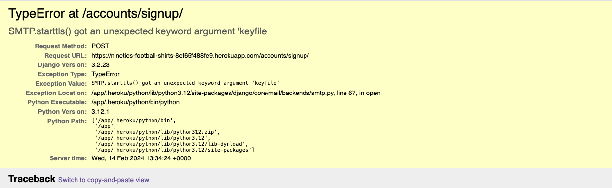

Ultimately, I decided to roll back, reinstall the versions I had of Django and its corresponding packages, and include a runtime.txt file with the Django version required for SMTP to continue without issues in the development process

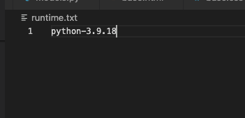

# Deployment
The version control to develope this site was done with _Gitpod_ and then deplyed to Heroku following those steps:

* Log in to Heroku app
* Create New App
* Select Region (Europe)
* Then Click on create App

The new app created in Heroku has to be linked to the database, for that i created a new one in ElephanSQL:

* Log in to Elephant SQL
* Create New Instance
* Selected _Tiny Turtle_ as plan
* Then select region (EU-NORTH)
* Review
* Create Instance
* Back to the dashboard in ElepantSQL, click on instance name
* Copy the database URL
* Back again to Heroku, move to settings, in Config Vars add DATABASE_URL and paste the URL from ElephantSQL
* Moving now to Gitpod, install dj-database_url and psycopg2 to connect to the external database
* Open the terminal and freeze requirements: pip3 freeze > requirements.txt
* Import dj_database_url in settings and update the database
* Then migrate the database
* Create the superuser
* Install Gunicorn
* Create Procfile
* Commit and push to GitHub
* Moving to Heroku, connect to GitHub Repository
* Deploy from branch
* Finally Open App

# Credits

For the development of the website, I found great inspiration in other pages that also specialize in the sale of retro/vintage football jerseys. Pages like _vintagefootball.shop_ or _retrojerseys.us_ were very helpful. I wanted to distinguish myself a bit from them by offering sports kits specifically focused on the 90s.

The product photos were taken from _retrojerseys.us_ and _myretrojerseys.com._

The walkthrough project _Boutique Ado_ and _I think therefore I blog_ were immensely helpful in developing some of the website's functionalities, such as connecting with Stripe, shopping cart, user validation, or checkout, in my case, Purchase.

For the implementation of the Agile methodology, _Kasia Boguck's_ videos were of great help.

Regarding the Readme, I relied on the one _Pauline Rugwevera_ prepared for her e-commerce PP5.

I wouldn't like to finish without mentioning the exceptional work of the tutors at Code Institute, especially _Oisin, Jason, Gemma, or Sean._ Without them, the elaboration of this project would have been much more difficult. Thank you very much!

